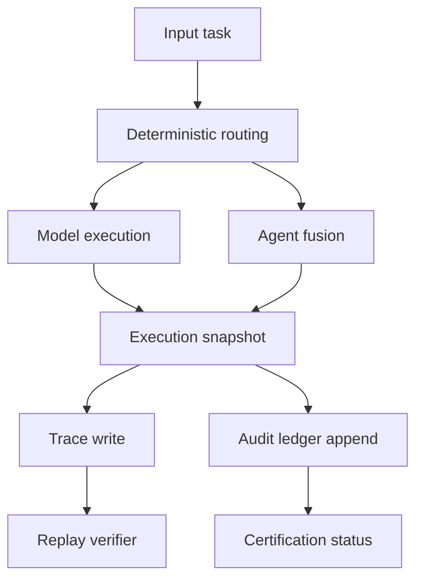

# Execution Flow

## Boundary Notes

- routing decisions are part of the trace
- selected agent is part of the trace
- invariant state is part of the trace
- replay compares output, route path, and invariant state

