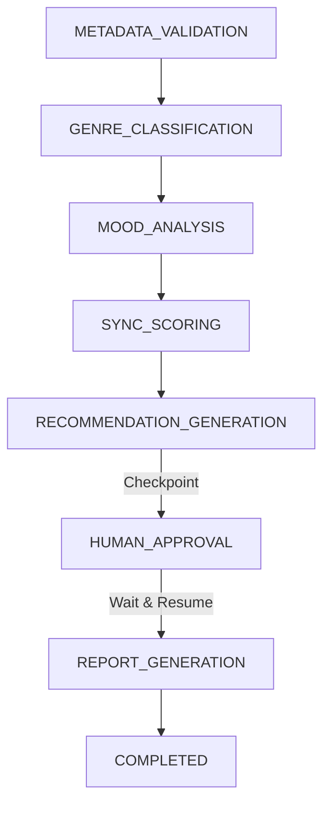
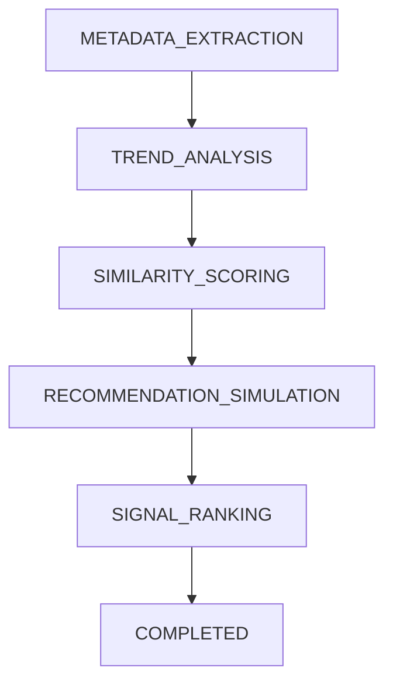

# Workflow Execution Maps

This document outlines the strict execution diagrams and policy checkpoints for Dakol-AI-OS governed workflows.

## SyncMaster AI Workflow

**Policy Checkpoints:**
- At `HUMAN_APPROVAL`, the workflow engine yields a `WAITING_FOR_APPROVAL` state.
- An immutable `checkpoint_xxx.json` is generated under `logs/workflows/`.
- Execution is strictly paused until deterministic resumption is triggered.

## Listening Farm AI Workflow

**Execution Safety:**
- Fails closed on any invalid transition.
- Max execution depth limits prevent infinite looping.
- Immutable fingerprints track stage inputs and outputs.
