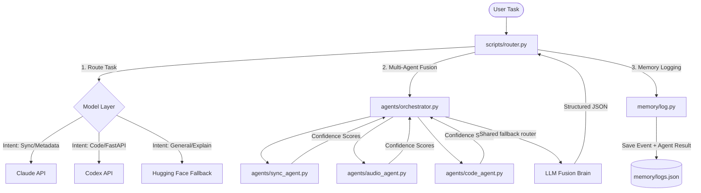

# Dakol-AI-OS: Progress & Next Steps Guide for Codex

Welcome! This document has been prepared by **Antigravity** to provide a clear, comprehensive handoff of the **Dakol-AI-OS** multi-agent task routing and intelligence fusion system. It details the architecture, diagnoses exactly where the last coding session stopped, and outlines a precise roadmap with the skills needed to continue.

---

## 🏗️ System Architecture

**Dakol-AI-OS** (built for the *SyncMaster* platform) is a learning-ready, multi-agent orchestrator and task router designed to intelligently delegate user tasks to specialized domain agents, execute them via diverse LLM models (Claude, Codex, Local), and fuse their reasoning into unified decisions.



### 1. Agents (`agents/`)
- **`base_agent.py`**: Declares `BaseAgent`, introducing domain weights and intelligence scoring boosts.
- **`sync_agent.py`**: The *SyncMaster* core intelligence agent. Heavy focus on music metadata reasoning (BPM, key, tempo, tagging) with a `domain_weight` multiplier of `1.3`.
- **`audio_agent.py`**: Detects audio understanding and analysis intents.
- **`code_agent.py`**: Detects software development, FastAPI endpoint building, and technical intents.

### 2. Orchestration & Fusion (`agents/orchestrator.py`)
- Runs a multi-agent consensus system. Collects intents and confidence levels from all domain agents.
- Uses the shared three-model fallback router (`groq/llama3-70b-8192` → `gemini/gemini-1.5-flash` → `hf/mistralai/Mistral-7B-Instruct-v0.3`) with a specialized fusion prompt to synthesize a final unified intent and reasoning.

### 3. Memory & Learning (`memory/`)
- **`logs.json`**: An active event logger storing historical task executions.
- **`log.py`**: A learning-ready log event engine capable of storing advanced agent metadata to enable future reinforcement learning and routing adaptation (preparing for Step 8 and 9).

---

## 🔍 Coding Session Diagnostics (Where You Stopped)

Your coding session stopped right after designing the multi-agent system and starting the implementation of `scripts/router.py`. Here are the specific findings:

### 1. Incomplete & Broken Router (`scripts/router.py`)
Running the router script yields a `NameError: name 'analyze_task' is not defined`.
The script references several functions and objects that are currently referenced but **not imported or defined**:
- `analyze_task(task)`: Logic to select the routing destination (`claude`, `codex`, or `local`) based on the task description.
- `run_claude(task)`: Connector to call the Anthropic API.
- `run_codex(task)`: Connector to call the OpenAI Codex API.
- `run_local(task)`: Connector to call the shared fallback router.
- `Orchestrator` & `log_event`: Need to be explicitly imported (`from agents.orchestrator import Orchestrator` and `from memory.log import log_event`).

### 2. Missing Environment Config (`.env`)
The python virtual environment has `anthropic`, `openai`, and `python-dotenv` installed, but no API keys or local configurations have been declared in a `.env` file yet.

---

## 🛣️ Codex Roadmap & Next Steps

To successfully complete the project, Codex should tackle the following milestones:

### 1. Fix the Task Router (`scripts/router.py`)
- Import `Orchestrator` from `agents.orchestrator` and `log_event` from `memory.log`.
- Implement `analyze_task(task)` to inspect incoming tasks and classify them into model families (`claude`, `codex`, or `local`).
- Implement the model execution engines using the installed packages:
  - `run_claude`: Using `anthropic.Anthropic()` client.
  - `run_codex`: Using `openai.OpenAI()` client.
  - `run_local`: Querying the shared fallback router, not a local subprocess.

> [!TIP]
> Refer to the code templates in the `skills/` folder to quickly restore these functions!

### 2. Configure Environment Variables
- Create a `.env` file at the root of the project with slots for:
  ```env
  ANTHROPIC_API_KEY=your-key-here
  OPENAI_API_KEY=your-key-here
  HF_API_TOKEN=your-token-here
  ```

### 3. Implement Meta-Learning & Self-Correction (Steps 8 & 9)
- **Step 8: Learning from Feedback**: Read `memory/logs.json` to analyze past predictions where the fused `confidence` score was low or where outputs were marked as errors, and update the router's classification heuristics.
- **Step 9: Dynamic Weighting**: Implement a mechanism in `Orchestrator` where agent `domain_weight` attributes are updated dynamically based on their matching accuracy over historical tasks logged in `logs.json`.

### 4. Phase 3: Semantic Routing Layer
Replace one-off keyword routing with explainable intent similarity while keeping the router contract stable.

Implemented first slice:
- Added `scripts/semantic_router.py` with intent profiles, normalized token matching, phrase scoring, cosine similarity, confidence, and matched-term explanations.
- Updated `scripts/router.py` so `analyze_task(task)` delegates to semantic routing while still returning only `claude`, `codex`, or `local`.
- Added route rationale output: intent, confidence, and matched terms.
- Added `tests/test_semantic_router.py` to lock routing behavior for code, architecture, and SyncMaster metadata tasks.
- Added optional embedding-backed routing gated by `SEMANTIC_ROUTER_EMBEDDINGS=openai`.
- Added profile embedding caching so profile examples are not re-embedded on every route.
- Added compact `route_decision` metadata for memory learning without storing raw embedding vectors.

Next Phase 3 steps:
- Install or configure OpenAI embeddings, e.g. set `OPENAI_EMBEDDING_MODEL=text-embedding-3-small`.
- Use logged `route_decision` metadata to start Phase 4 outcome scoring and adaptive routing.
- Expand intent profiles for SyncMaster workflows: metadata tagging, licensing recommendations, composer-to-brief matching, and audio analysis.
- Add confidence thresholds for escalation: low-confidence local tasks should ask for fusion or route to Claude for reasoning.

### 5. Phase 4: Adaptive Learning Layer
Use logged route and fusion outcomes to create a compact learning state that can bias future routing without replacing semantic routing.

Implemented:
- Added `memory/learning.py` to score route events, tolerate legacy logs without `agent_result`, and derive `memory/learning_state.json`.
- Added `model_bias` and `agent_bias` summaries with conservative filtering so unknown legacy entries do not influence routing.
- Updated `scripts/router.py` to refresh learning state after each logged route.
- Updated `scripts/semantic_router.py` so strong learned model bias can override a selected model only when sample size and confidence thresholds are met.
- Added `learning_applied` and `original_model` fields to `RouteDecision` for explainable adaptive routing.
- Added `tests/test_learning.py` plus adaptive-bias tests in `tests/test_semantic_router.py`.
- Added dynamic agent weighting in `Orchestrator.__init__` using `agent_bias` with clamped multipliers.
- Added `tests/test_orchestrator.py` to verify default weights are preserved and learned multipliers are applied safely.
- Added stable `event_id` values to new memory events and a feedback API for `good`, `bad`, `wrong_model`, and `retry_needed`.
- Updated learning scores and model bias selection so explicit feedback affects future routing decisions.
- Replaced the older `scripts/memory.py` logger with a compatibility wrapper around `memory/log.py`.
- Added `tests/test_memory_log.py` and `tests/test_memory_compat.py` for feedback and legacy import coverage.

Current Phase 4 behavior:
- Existing historical logs are analyzed, but older entries without route metadata are counted only as legacy context.
- No adaptive model bias is active until new route logs contain `route_decision` metadata with enough successful samples.
- Learning biases routing only when `sample_size >= 3` and aggregate confidence is at least `0.75`.
- Agent weights remain unchanged until `agent_bias` has at least 3 samples for an agent; learned multipliers are clamped from `0.75` to `1.35`.
- Explicit feedback can now reinforce or penalize a route event and is reflected in regenerated learning state.
- Legacy `scripts.memory` imports now use the canonical memory logger, preventing divergent log shapes.

Phase 4 completion status:
- Complete. Full test discovery passes with 34 tests.

### 6. Phase 5: Autonomous Agent OS
Add a CLI-first autonomous execution layer on top of routing, orchestration, tools, memory, and learning.

Implemented:
- Added `planning/` with deterministic and optional Claude planning providers, structured plan schema, provider selection, and plan validation.
- Added token-safe planning defaults so Claude is optional and tests never require a live Claude call.
- Added `runtime/` task persistence with queued, running, completed, failed, and cancelled states in `memory/tasks.json`.
- Added `tools/` with a schema-validated safe tool registry: `read_file`, `list_files`, `search_repo`, `route_task`, `update_learning_state`, and `record_feedback`.
- Added `workflows/` with dependency-ordered workflow execution, cycle detection, output passing, and template references.
- Added `memory/graph.py` as a persistent JSON node/edge memory graph for tasks, plans, steps, tools, outputs, and relations.
- Added `scripts/os_cli.py` with `plan`, `run`, `queue`, `process-queue`, `status`, `tasks`, `feedback`, `learn`, and `memory search` commands.
- Added Phase 5 planner, runtime, tool, workflow, graph, and CLI tests.

Current Phase 5 behavior:
- `scripts/os_cli.py plan` generates a validated structured plan without requiring API keys.
- `scripts/os_cli.py run` submits a persistent task, executes the validated workflow, stores task results, and records graph relationships.
- `scripts/os_cli.py queue` stores planned work for later, and `scripts/os_cli.py process-queue` executes queued tasks.
- `scripts/os_cli.py tasks` and `scripts/os_cli.py status` expose persisted task history.
- `scripts/os_cli.py learn` regenerates adaptive learning state.
- `scripts/os_cli.py memory search` queries graph memory.
- Claude planning is available through the planning provider interface but falls back safely when unavailable.
- Dangerous shell execution is not registered as a tool.

Phase 5 completion status:
- Complete. Full test discovery passes with 70 tests.
- Smoke verified with deterministic planner: `plan`, `run`, `queue`, `process-queue`, `tasks`, `learn`, and `memory search` all execute successfully.

### 7. Phase 6: SyncMaster Intelligence Layer
Add the SyncMaster application layer for music metadata, sync licensing recommendations, composer/track matching, audio intelligence, and graph persistence.

Implemented:
- Added `syncmaster/` with deterministic metadata analysis for BPM, key, mood, genre, energy, and vocals/instrumental.
- Added SyncMaster schema objects for track metadata, metadata analysis, briefs, and composer profiles.
- Added sync licensing recommendation logic with fit score, usage suggestions, clearance notes, risk flags, and reasoning.
- Added deterministic brief matching for tracks and composers by mood, genre, tempo, instrument, vocal profile, and keywords.
- Added audio intelligence composition that combines metadata analysis with optional licensing fit.
- Added SyncMaster graph helpers for track, brief, composer, and recommendation nodes and relations.
- Registered SyncMaster tools in the Phase 5 tool registry: metadata analysis, sync fit recommendation, brief matching, graph save/query.
- Updated deterministic planning so SyncMaster metadata and licensing objectives select real SyncMaster tools instead of only routing aliases.
- Added `scripts/os_cli.py syncmaster` commands for `analyze-metadata`, `recommend-fit`, `save-track`, `save-brief`, and `save-recommendation`.
- Extended autonomous workflow graph persistence to store SyncMaster analysis and recommendation outputs.
- Added SyncMaster unit, workflow/tool, planner, and CLI tests.

Current Phase 6 behavior:
- CLI metadata analysis returns structured JSON without external audio libraries or API calls.
- CLI sync licensing recommendations return deterministic fit decisions and clearance/risk notes.
- Autonomous `plan` and `run` can select and execute SyncMaster tools for metadata tasks.
- SyncMaster entities and workflow outputs persist into `memory/graph_store.json`.
- Malformed SyncMaster CLI JSON returns structured error JSON instead of a traceback.
- A SyncMaster PRD is not required for the current implementation, but it would improve future domain-specific workflows and scoring rules.

Phase 6 completion status:
- Complete. Full test discovery passes with 92 tests.
- Smoke verified: `syncmaster analyze-metadata`, `syncmaster recommend-fit`, deterministic `plan`, deterministic `run`, and `memory search` execute successfully.

### 8. Phase 8A/8B: Real Audio Analysis + Optional Model Tagging
Add real audio ingestion while keeping the OS local-first and dependency-safe.

Implemented:
- Rebuilt `syncmaster/audio.py` as a real audio analysis layer.
- Added standard-library WAV analysis for duration, sample rate, channels, RMS, peak, loudness, zero-crossing rate, estimated BPM, estimated key placeholder, and energy.
- Added optional ffmpeg conversion for non-WAV inputs when `ffmpeg` is installed.
- Added a preferred lazy `librosa` backend for tempo, duration, RMS, loudness, spectral centroid, zero-crossing rate, onset strength, beat count, and energy, with standard-library WAV fallback.
- Added disabled-by-default model tagging hooks controlled by `SYNCMASTER_AUDIO_TAGGER`; no Hugging Face, Torch, TensorFlow, or Essentia dependency is imported unless a future provider is explicitly configured.
- Fixed `analyze_audio_intelligence` so it works with the current metadata schema and licensing wrapper.
- Added `scripts/os_cli.py syncmaster analyze-audio --audio-path ... --payload-json ...`.
- Registered `syncmaster_analyze_audio` in the tool registry.
- Added optional dependency files: `requirements-audio.txt` and `requirements-model-tagging.txt`.
- Added audio unit, CLI, and registry test coverage with generated WAV fixtures.

Current Phase 8 behavior:
- Real WAV files can be analyzed without installing extra Python packages.
- Non-WAV files return a clear warning unless ffmpeg is installed, then they are converted to WAV for local analysis.
- When `librosa` is installed and `SYNCMASTER_AUDIO_BACKEND` is `auto` or `librosa`, the audio analyzer uses `analysis_backend: librosa`.
- Set `SYNCMASTER_AUDIO_BACKEND=wave` to force the standard-library fallback.
- Model tagging remains opt-in and currently returns structured warnings instead of downloading or importing heavyweight models.
- Syncmaster-Live can send multipart audio files to `/api/ai/tagger`; the API writes a temp file, calls the OS audio analyzer, and cleans up.

Phase 8A/8B completion status:
- Complete. Full Dakol-AI-OS test discovery passes with 98 tests.
- Syncmaster-Live type-check, production build, and tagger API tests pass with multipart audio coverage.
