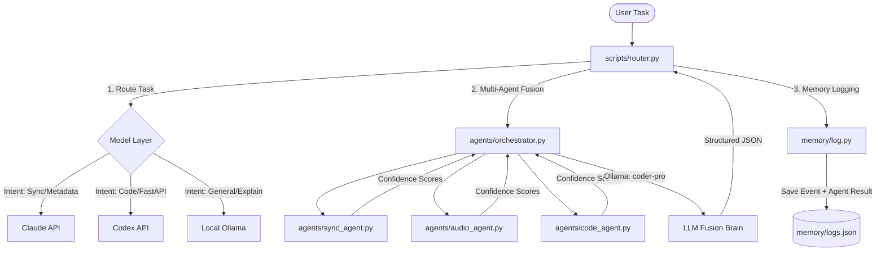

# Dakol-AI-OS: Progress & Next Steps Guide for Codex

Welcome! This document has been prepared by **Antigravity** to provide a clear, comprehensive handoff of the **Dakol-AI-OS** multi-agent task routing and intelligence fusion system. It details the architecture, diagnoses exactly where the last coding session stopped, and outlines a precise roadmap with the skills needed to continue.

---

## 🏗️ System Architecture

**Dakol-AI-OS** (built for the *SyncMaster* platform) is a learning-ready, multi-agent orchestrator and task router designed to intelligently delegate user tasks to specialized domain agents, execute them via diverse LLM models (Claude, Codex, Local), and fuse their reasoning into unified decisions.



### 1. Agents (`agents/`)
- **`base_agent.py`**: Declares `BaseAgent`, introducing domain weights and intelligence scoring boosts.
- **`sync_agent.py`**: The *SyncMaster* core intelligence agent. Heavy focus on music metadata reasoning (BPM, key, tempo, tagging) with a `domain_weight` multiplier of `1.3`.
- **`audio_agent.py`**: Detects audio understanding and analysis intents.
- **`code_agent.py`**: Detects software development, FastAPI endpoint building, and technical intents.

### 2. Orchestration & Fusion (`agents/orchestrator.py`)
- Runs a multi-agent consensus system. Collects intents and confidence levels from all domain agents.
- Queries a local Ollama model (`coder-pro:latest` based on `qwen2.5-coder:7b`) with a specialized fusion prompt to synthesize a final unified intent and reasoning.

### 3. Memory & Learning (`memory/`)
- **`logs.json`**: An active event logger storing historical task executions.
- **`log.py`**: A learning-ready log event engine capable of storing advanced agent metadata to enable future reinforcement learning and routing adaptation (preparing for Step 8 and 9).

---

## 🔍 Coding Session Diagnostics (Where You Stopped)

Your coding session stopped right after designing the multi-agent system and starting the implementation of `scripts/router.py`. Here are the specific findings:

### 1. Incomplete & Broken Router (`scripts/router.py`)
Running the router script yields a `NameError: name 'analyze_task' is not defined`.
The script references several functions and objects that are currently referenced but **not imported or defined**:
- `analyze_task(task)`: Logic to select the routing destination (`claude`, `codex`, or `local`) based on the task description.
- `run_claude(task)`: Connector to call the Anthropic API.
- `run_codex(task)`: Connector to call the OpenAI Codex API.
- `run_local(task)`: Connector to call the local Ollama instance.
- `Orchestrator` & `log_event`: Need to be explicitly imported (`from agents.orchestrator import Orchestrator` and `from memory.log import log_event`).

### 2. Missing Environment Config (`.env`)
The python virtual environment has `anthropic`, `openai`, and `python-dotenv` installed, but no API keys or local configurations have been declared in a `.env` file yet.

---

## 🛣️ Codex Roadmap & Next Steps

To successfully complete the project, Codex should tackle the following milestones:

### 1. Fix the Task Router (`scripts/router.py`)
- Import `Orchestrator` from `agents.orchestrator` and `log_event` from `memory.log`.
- Implement `analyze_task(task)` to inspect incoming tasks and classify them into model families (`claude`, `codex`, or `local`).
- Implement the model execution engines using the installed packages:
  - `run_claude`: Using `anthropic.Anthropic()` client.
  - `run_codex`: Using `openai.OpenAI()` client.
  - `run_local`: Querying `http://localhost:11434/api/generate` or running local subprocess commands for Ollama.

> [!TIP]
> Refer to the code templates in the `skills/` folder to quickly restore these functions!

### 2. Configure Environment Variables
- Create a `.env` file at the root of the project with slots for:
  ```env
  ANTHROPIC_API_KEY=your-key-here
  OPENAI_API_KEY=your-key-here
  OLLAMA_API_BASE=http://localhost:11434
  ```

### 3. Implement Meta-Learning & Self-Correction (Steps 8 & 9)
- **Step 8: Learning from Feedback**: Read `memory/logs.json` to analyze past predictions where the fused `confidence` score was low or where outputs were marked as errors, and update the router's classification heuristics.
- **Step 9: Dynamic Weighting**: Implement a mechanism in `Orchestrator` where agent `domain_weight` attributes are updated dynamically based on their matching accuracy over historical tasks logged in `logs.json`.
